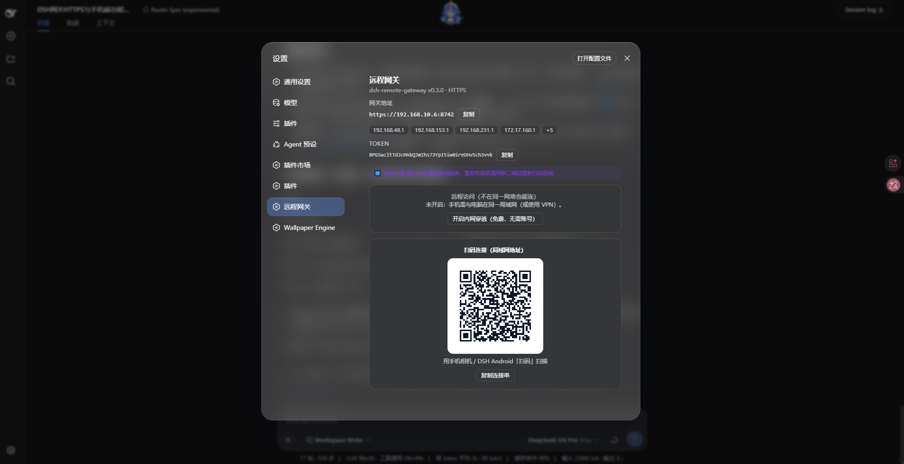
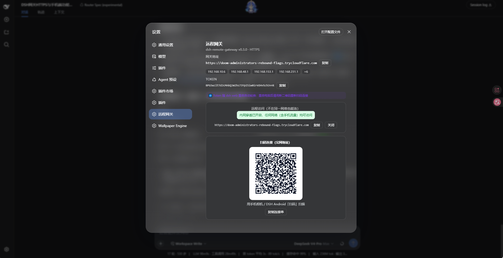

<div align="center">

# 🤖 DeepSeek Harness Android

<p align="center">
  <strong>在手机上遥控电脑上的 <a href="https://github.com/deepseek-ai/deepseek-harness">DeepSeek Harness</a> —— 局域网、公网都能连</strong>
</p>

<p align="center">
  发布任务 · 实时查看过程 · 追踪 Token 消耗 · 扫码即连 · 一键内网穿透
</p>

<p align="center">
  
  
  
  
  
  
  
</p>

</div>

---

## 🎯 项目简介

在 Android 手机上远程操控电脑端的 **DeepSeek Harness（DSH）**：

- 📤 **发布任务**到电脑运行，实时查看回复流、思考过程、工具调用、任务清单
- 📊 **追踪 Token 消耗**（输入/输出/缓存读写/上下文占用与构成）
- 📱 **扫码即连**：内置摄像头扫码、局域网扫描、公网一键内网穿透
- 🔮 **完整开发接口**：与网页端使用完全相同的官方 wire 契约

> ⚠️ **官方现状**：`dsh web` 出于安全考虑**仅监听 127.0.0.1 且无认证**（`--host 0.0.0.0` 被 CLI 硬性拒绝）。
>
> ✅ **本方案**：增加一个 **PC 端认证网关**，以最小暴露面把 DSH `/api` 以
> **Bearer token + 默认 HTTPS** 提供给手机；网关既可作为**独立进程**运行，
> 也可作为 **DSH bundle 插件**导入 `dsh web`。Android 端直接实现 DSH 官方
> wire 协议（四象限 RPC + 双 WebSocket 下行流）。

---

## 📸 截图

<
  | 手机端（发布任务、查看过程、追踪 Token 消耗） 
  |  

  | PC 网关面板（地址/Token/二维码） | 一键内网穿透 |
  |---|---|
  |  |  |
>

---

## 📑 目录

- [🏗️ 架构](#-架构)
- [📦 仓库结构](#-仓库结构)
- [🚀 快速开始](#-快速开始)
- [✨ 功能清单](#-功能清单)
- [🔐 安全模型](#-安全模型)
- [🌍 远程访问（内网穿透）](#-远程访问内网穿透)
- [❓ 常见问题](#-常见问题)
- [📚 文档](#-文档)
- [🗺️ 路线图](#-路线图)
- [🔗 参考来源](#-参考来源)
- [📄 License](#-license)

---

## 🏗️ 架构

```
┌───────────────────────────────┐         HTTPS/WSS（局域网 or 公网，Bearer token 认证）
│  Android 手机                  │ ───────────────────────────────────────────────┐
│  Kotlin + Jetpack Compose     │                                                │
│  · DshApiClient（HTTP RPC）   │                                                ▼
│  · ConnectionManager（双 WS） │                          ┌──────────────────────────────────┐
│  · ZXing 摄像头扫码           │                          │ PC: dsh-remote-gateway             │
│  · 深链 dsh-gateway://        │                          │ (Node.js，独立进程 or DSH 插件)     │
└───────────────────────────────┘                          │ · 只暴露 /api + 两个 WS + /upload  │
        ▲                                                 │ · Bearer token 校验（timing-safe） │
        │ 公网：https://xxx.trycloudflare.com             │ · 默认 HTTPS（自签名自动生成）     │
        │ 局域网：https://<电脑IP>:8742                    │ · 面板：地址/Token/二维码/穿透开关   │
        │                                                 └───────────────┬──────────────────┘
┌───────┴──────────┐                                                       │ HTTP/WS → 127.0.0.1
│ Cloudflare 边缘   │ ← QUIC/HTTP2 ← cloudflared（插件内置一键内网穿透）      │ （loopback，DSH 信任围栏放行）
└──────────────────┘                                                       ▼
                                                          ┌──────────────────────────────────┐
                                                          │ PC: dsh web（DeepSeek Harness）    │
                                                          │ · 保持 127.0.0.1:3080 不动          │
                                                          │ · /api 四象限 RPC + 事件流          │
                                                          └──────────────────────────────────┘
```

**为什么必须加网关**：`dsh web --host 0.0.0.0` 被官方 CLI 硬性拒绝（`/api` 等于远程代码执行且无认证层），
官方路线是「远程访问前先有部署方认证层」——网关就是这层认证，DSH 本体零改动、随时可官方升级。

---

## 📦 仓库结构

```
DeepSeek-Harness-Android/
├── 📁 android/                     # Android 客户端（Kotlin + Jetpack Compose + Material 3）
│   └── app/src/main/java/com/dsh/android/
│       ├── 📁 data/protocol/       # DSH 官方 wire 契约的 Kotlin 镜像（信封/事件/帧/投影）
│       ├── 📁 data/remote/         # DshApiClient（HTTP RPC）+ ConnectionManager（双 WS 重连）+ LanScanner
│       ├── 📁 data/store/          # ServerConfigStore（Keystore 加密）+ SessionStore + BackgroundStore
│       └── 📁 ui/                  # Compose 界面（服务器/会话/聊天/扫码/背景/审批/提问）
│
├── 📁 gateway/                     # PC 端远程网关（Node.js + ws，Bearer 认证代理）
│   ├── src/
│   │   ├── gateway.js              # 共享网关核心（鉴权/代理/WS 桥/上传/ident）
│   │   ├── index.js                # 独立进程入口（CLI + dsh 托管 supervisor + token 管理）
│   │   ├── plugin.js               # DSH bundle 插件入口（webServer 路由 + 面板 API + 内网穿透）
│   │   ├── tunnel.js               # cloudflared 快速隧道管理（下载/启动/自愈/健康探针）
│   │   └── client-panel.js         # DSH Web 设置面板（地址/Token/二维码/穿透开关）
│   ├── lib/                        # 插件产物（index.js + client.js）
│   ├── cordis.patch.yml            # bundle 装配补丁
│   ├── scripts/                    # build-client / 测试脚本
│   └── tunnel-test/                # 内网穿透端到端测试（真实公网隧道验证）
│
├── 📁 tools/                       # 开发辅助脚本（Gradle 下载、WS 测试、协议探测）
│
├── 📁 docs/
│   ├── 📄 ARCHITECTURE.md          # 总体架构与安全模型
│   ├── 📄 PROTOCOL.md              # DSH /api wire 协议参考（基于官方契约整理）
│   └── 📄 ROADMAP.md               # 后续开发路线
│
├── 📄 GITHUB-README.md             # 本文件（发布 GitHub 时可替换 README.md）
└── 📄 DSH-Android-v0.3.0-beta.apk  # 已编译的安装包（android/app/build/outputs/apk/debug/app-debug.apk）
```

---

## 🚀 快速开始

### 1. 🖥️ 电脑端 — 二选一启动

**方式 A：独立进程（一条命令启动全部）**

```bash
cd gateway
npm install            # 首次
# 双击 gateway\start.bat（或 npm start / node src/index.js）
```

网关会自动探测并启动 DeepSeek Harness（`dsh web`），崩溃自动重启，Ctrl+C 连带关闭 DSH。

**方式 B：作为 DSH 插件导入（随 dsh web 一起启动）**

```bash
dsh plugin add <本项目 gateway 目录绝对路径>
```

导入后 `dsh web` 的 **设置 → 远程网关** 会出现管理面板（地址 / Token / 二维码 / 内网穿透开关）。

**首次运行自动完成：**

| 项 | 说明 |
|---|---|
| 🔑 随机 Token | 32 字节 base64url，写入 `gateway.config.json` 与 `gateway.token`；`npm run print-token` 查看、`npm run rotate-token` 轮换 |
| 🔒 HTTPS 证书 | `tls.auto: true` 默认自动生成自签名证书（无需 openssl），监听 `0.0.0.0:8742` |
| 🎨 管理面板 | 插件模式下在 DSH Web 设置页展示网关信息与二维码 |

### 2. 📱 手机端

**安装 APK**

- 直接安装仓库根目录的 `DSH-Android-v0.3.0-beta.apk`；或
- 源码构建：Android Studio 打开 `android/`，或 `gradlew.bat :app:assembleDebug`
  （产物 `android/app/build/outputs/apk/debug/app-debug.apk`）。

**首次连接（推荐：扫码）**

```
电脑端：dsh web → 设置 → 远程网关（显示二维码）
  ↓
手机端：打开 App → 服务器页 → 点「扫码」
  ↓
点「打开摄像头扫码」→ 直接调用手机摄像头（竖屏）对准二维码
  ↓
识别成功 → 自动连接 → 直接进入聊天框 ✅
```

> 备用方式：🔍 局域网扫描（自动发现网关，公网地址旁可点「远程」预填）、
> 手动输入 `https://电脑IP:8742` + Token（`https://` 地址可开启「信任自签名证书」）。

---

## ✨ 功能清单

> 当前版本：**v0.3.0-beta**

| 🏷️ 能力 | 📖 说明 | 🔌 协议/实现 |
|:---------|:--------|:--------|
| **🔒 HTTPS + 自签名信任** | 网关自动生成自签名证书走 HTTPS；App 逐服务器「信任自签名证书」（token 加密传输） | TLS / OkHttp |
| **🧩 网关插件化** | 网关可独立 `npm start`，也可 `dsh plugin add` 作为 bundle 插件随 `dsh web` 启动 | cordis bundle |
| **🔁 Token 重启轮换** | 插件模式下 Token 默认随每次 `dsh web` 重启自动随机重生成（旧 Token 立即作废，面板重新扫码）；可固定 Token 或 `rotateOnRestart:false` 关闭 | 随机生成 + 原子落盘 |
| **🌍 一键内网穿透** | 面板一键开启 Cloudflare 免费隧道，公网地址 + 二维码自动切换，手机任意网络（含流量）可连；含下载引导、崩溃无限重启、20s 健康探针自愈 | cloudflared Quick Tunnel |
| **📱 扫码配对（内置摄像头·竖屏）** | PC 面板生成校验过的二维码（`dsh-gateway://connect` 深链）；手机「扫码」直接调用摄像头识别，也可系统相机/粘贴连接串 | ZXing + 深链 |
| **🎯 连接即进聊天** | 连接成功后自动打开最近会话（无则新建），直接进入聊天框 | `session.list` / `session.create` |
| **💬 聊天 UI（DeepSeek 网页布局）** | 居中消息列（平板限宽、手机全宽）、左侧模型头像+名称、右侧用户气泡、底部圆角输入条；Token/上下文双行布局 | Compose |
| **🔍 局域网扫描发现** | 一键扫 /24 网段 × 8742/8743/8744（HTTP+HTTPS），`/ident` 精确识别，已存 Token 一步直连 | `GET /ident` |
| **📤 发布任务** | 新建会话 + 排队/打断两种模式 | `session.create` / `session.prompt` |
| **📡 实时过程** | 流式回复、思考过程、工具调用+结果卡、todo 清单、每轮状态、后台任务条 | WS `/api/events.mux` / `events.host` |
| **📊 Token 消耗** | 累计输入/输出/缓存读写、每轮增量、上下文占用与构成 | `session/projection` 帧 |
| **🧠 上下文 UI 优化** | 占用条阈值变色（绿/黄/红）+ 剩余窗口；堆叠条可视化系统/工具/消息构成 | `contextPressure` / `contextBreakdown` |
| **🎨 自定义背景** | 服务器页「背景」切换预设纯色/渐变或相册图片，全局生效 | — |
| **🎮 任务控制** | 停止当前轮、模型切换、重命名 | 对应 RPC |
| **🗑 删除对话** | 会话列表 🗑 一键删除（确认后电脑端归档，列表即时移除，重连/刷新不复活） | `workspace.archiveSession` + `host/archived-sessions-changed` |
| **✅ 远程审批** | 沙箱操作审批（允许一次/拒绝）、代理提问回答（默认关闭，逐服务器开关） | `approval/requested` → `POST /api/respond` |
| **🔄 断线恢复** | 双流自动重连 + 指数退避 + 订阅基线 gap 补拉 | 官方 ConnectionController 同款策略 |
| **⏱️ 超时自愈** | RPC 60s 硬超时、上传 10min；超时自动重建双流；120s 无新消息温和提示 | OkHttp callTimeout |
| **🔐 Token 静态加密** | 服务器库（含网关 Token）经 Android Keystore（AES256-GCM）加密存储；云备份关闭 | security-crypto |
| **⚡ 连接速度优化** | 网关 gzip 压缩 JSON（历史页实测 **-93%**）、WS 压缩协商、Nagle 关闭、keep-alive 30s | — |
| **🪶 上下文轻载** | 默认只传最近一轮，更早内容按页加载（`beforeSeq` 翻页，位置不跳动） | `session.history` 分页 |
| **📎 手机传文件到电脑** | 聊天页 📎 流式上传（进度条）到会话工作区 `uploads/`，自动填入引用 | 网关 `PUT /upload` |
| **💬 聊天流畅度** | 流式阶段纯文本渲染、80ms 采样折叠、列表 contentType 复用 | — |

---

## 🔐 安全模型

| 层 | 机制 | 说明 |
|---|---|---|
| 传输 | 默认 HTTPS（自签名自动生成）/ 公网隧道为 Cloudflare 真实证书 | token 全程加密传输 |
| 认证 | 每个 HTTP 请求 / WS 升级校验 `Authorization: Bearer <token>`；插件模式 Token 默认**随 dsh web 重启自动轮换** | SHA-256 + timingSafeEqual 比较 |
| 暴露面 | 只允许 `/api/*`（POST）、两个 WS 路径、`/upload` | 网页 UI/静态资源一律 404 |
| 未鉴权端点 | `GET /ident`（识别信息 + scheme + 证书指纹 + 公网地址）、`GET /health`（仅上游可达性布尔值） | 扫描发现专用，不含主机细节 |
| 上游围栏 | 网关以 `Host: 127.0.0.1` 回连 | 命中 DSH loopback 信任围栏，DSH 零改动 |
| 审批安全 | 手机默认**不能**远程回答审批/提问 | `allowRemoteAnswers` 逐服务器开启 |
| 本地存储 | 网关 Token 用 Android Keystore（AES256-GCM）加密 | 云备份关闭 |

> ⚠️ 拿到 token 即等于电脑上的远程代码执行权限：token 按密码对待，请勿泄露；
> 公网隧道模式下请定期 `npm run rotate-token` 轮换。

---

## 🌍 远程访问（内网穿透）

**一键开启（推荐）**：`dsh web → 设置 → 远程网关 → 点「开启内网穿透」`

- 基于 **Cloudflare Quick Tunnel**：免费、无需账号、无需公网服务器、无需端口转发；
- 首次自动下载 `cloudflared`（约 55MB，存于 `~/.dsh/remote-gateway/`，也可手动放置后配置 `tunnel.binary`）；
- 约 10–30 秒得到公网地址 `https://xxx.trycloudflare.com`，面板二维码自动切换；
- 内置**自愈**：崩溃无限重启（新地址自动刷新面板/QR）、20 秒健康探针、连续失败自动重建；
- 手机在**任何网络**（含蜂窝流量）扫码即连；局域网扫描结果也会显示该公网地址（点「远程」预填）。

**其他方式**：VPN/Tailscale、路由器端口转发 + `publicBaseUrl`（详见 `gateway/README.md`）。

> 📌 免费 Quick Tunnel 的地址随机且每次重启会变：隧道重启后请用面板**新二维码**重新扫码；
> 长期固定地址可用 Cloudflare 命名隧道 / frp（需自有账号或服务器）。

---

## ❓ 常见问题

| 问题 | 解答 |
|---|---|
| 手机提示 `Expected HTTP 101 but was '502/530'` | 公网隧道不可用或地址已变化（530=边缘连不上隧道，502=隧道连不上本地网关）。稍候重试；持续出现则重启 `dsh web`、重新开启内网穿透并用新二维码扫码 |
| 扫码失败 / 二维码解不出 | 当前版本二维码由 `qrcode` 库生成，已经 jsQR + ZXing 双解码器实测通过；请确认电脑屏幕亮度足够、二维码完整显示（含白边） |
| 摄像头扫码是横屏？ | 已强制竖屏（Manifest `screenOrientation="portrait"` + `setOrientationLocked(false)`） |
| 手动地址要不要填 `http://`？ | 输入 IP 会自动补全；网关默认 HTTPS，请用 `https://` 并开启「信任自签名证书」 |
| 删除对话后还会出现吗？ | 不会。删除走官方 `workspace.archiveSession`（电脑端归档），并通过 `host/archived-sessions-changed` 推送与 `workspace.list` 冷启动同步 |
| 重启电脑后手机连不上了？ | 正常现象：插件模式 Token 默认随 `dsh web` 重启自动轮换（旧 Token 作废），公网隧道地址也会变——用面板新二维码重新扫码即可；想保持稳定可配 `"token": { "rotateOnRestart": false }` |
| 找不到网关？ | 确认电脑防火墙放行 8742、手机与电脑同一局域网、路由器未开 AP 隔离；或用扫码/内网穿透 |

---

## 📚 文档

| 文档 | 内容 |
|------|------|
| [📄 ARCHITECTURE.md](docs/ARCHITECTURE.md) | 架构设计、安全模型、为什么需要网关 |
| [📄 PROTOCOL.md](docs/PROTOCOL.md) | DSH `/api` 协议完整参考（本项目实现依据） |
| [📄 ROADMAP.md](docs/ROADMAP.md) | 后续开发计划 |
| [📄 gateway/README.md](gateway/README.md) | 网关配置、插件导入与部署指南 |

---

## 🗺️ 路线图

- **v0.4**：后台保活与通知（前台服务、完成/审批通知）、Workspace 管理、会话搜索、排队消息管理
- **v0.5**：按模型单价估算费用、用量历史折线、上下文占用告警
- **v0.6**：子代理树视图、Goal 模式面板、快捷命令、深色模式跟随、大屏布局、iOS/跨端平移

> 详细计划见 [docs/ROADMAP.md](docs/ROADMAP.md)。

---

## 🔗 参考来源

### 官方资源

- 🏠 **官方仓库**：[deepseek-ai/deepseek-harness](https://github.com/deepseek-ai/deepseek-harness)
- 📖 官方包：`dsh-host-apiproxy` / `dsh-client-connection` / `dsh-session` / `dsh-token-meter` / `dsh-workspace`
- ☁️ [Cloudflare Quick Tunnel](https://developers.cloudflare.com/cloudflare-one/connections/connect-networks/do-more-with-tunnels/trycloudflare/)

### 社区资源

- [awesome-deepseek-harness](https://github.com/0xsline/awesome-deepseek-harness)
- [deepseek-harness-desktop（Electron 壳）](https://github.com/RZX00/deepseek-harness-desktop)

> 🏆 目前社区主要是桌面壳，本项目是**面向手机（Android）远程控制的实现**，
> 并额外提供：认证网关插件、一键内网穿透、扫码配对与 DeepSeek 网页风格聊天 UI。

---

## 📄 License

本项目采用 [MIT](LICENSE) 许可证开源。

> 免责声明：本项目为个人学习/效率工具；远程代码执行能力由 DSH 本身提供，
> 请仅在自有设备与可信网络中使用，并妥善保管网关 Token。

---

<div align="center">

**📝 该软件目前开发中 · PR & Issue 欢迎提交**

</div>
